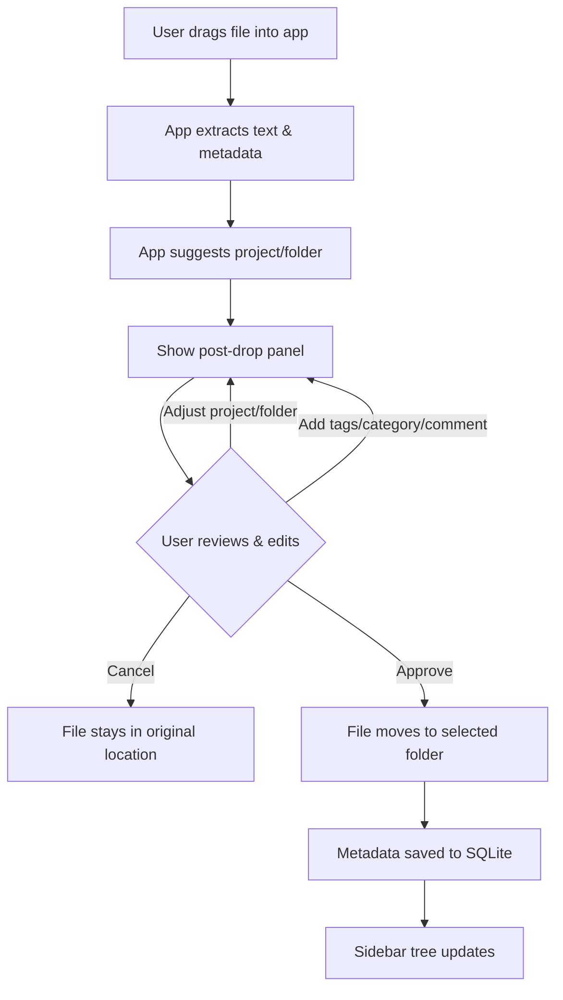
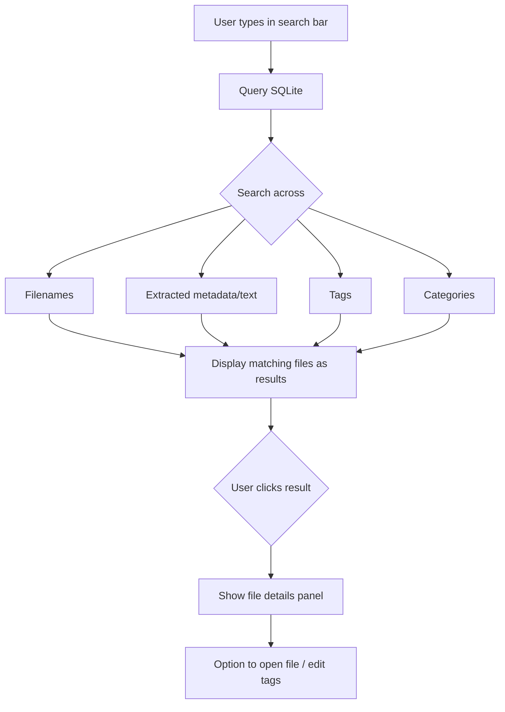
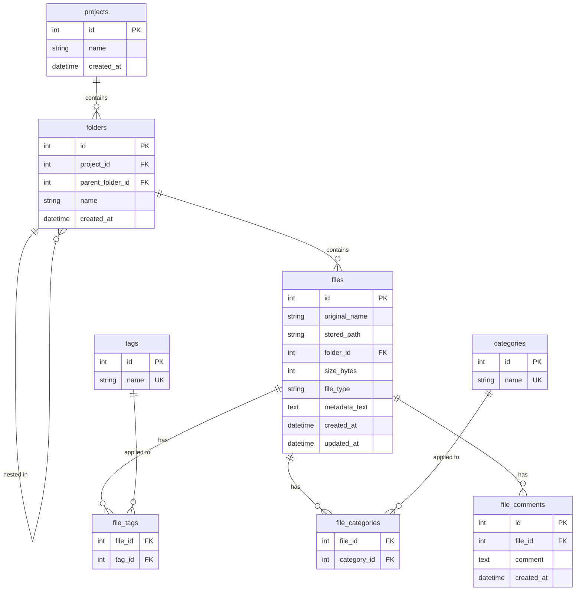

# jDocs - Project Plan

## Current State
**Phase:** Development
**Status:** Session 02 in progress

## What's Done
- [x] Project concept defined (jDocs)
- [x] Cross-platform support confirmed (Windows + macOS)
- [x] Tech stack selected (Python, SQLite, PyInstaller)
- [x] Use cases defined (File Input + Search)
- [x] Workflow and tracking system designed
- [x] Project structure created

## Session Roadmap

| Session | Title | Deliverable | Status | Date |
|---------|-------|-------------|--------|------|
| 01 | Project Skeleton & UI Framework Decision | Launchable app window with base layout skeleton | Done | 2026-02-09 |
| 02 | Database Schema & Core Data Layer | Working database module with CRUD operations and passing tests | Done | 2026-02-09 |
| 03 | File Metadata Extraction Engine | Module that extracts text/metadata from .docx, .xlsx, .pptx, images | Planned | TBD |
| 04 | Drag & Drop File Input Workflow | Functional drag & drop with post-drop UI (project/folder dropdowns, metadata preview) | Planned | TBD |
| 05 | Tagging, Categorization & Folder Management | Tag/category/comment input, create new project/folder, file move on approve | Planned | TBD |
| 06 | Search Functionality | Working search bar with filters across filenames, metadata, tags | Planned | TBD |
| 07 | First Launch Setup & Root Folder Config | First-run wizard to select root folder, settings persistence | Planned | TBD |
| 08 | Polish, Error Handling & Testing | Stable app with edge case handling and test coverage | Planned | TBD |
| 09 | PyInstaller Packaging & Distribution | Standalone .exe (Windows) and .app (macOS) | Planned | TBD |

> Sessions may be added, split, or reordered as the project evolves.

## App Layout

```
+----------------------------------------------------------+
|  jDocs                                            [—][x] |
+----------------------------------------------------------+
|  [ Search files, tags, metadata...              ] [Filter]|
+----------------------------------------------------------+
|  Projects        |                                        |
|  ┌──────────┐    |     +----------------------------+     |
|  │ > Work   │    |     |                            |     |
|  │   Reports│    |     |     Drop files here        |     |
|  │   Slides │    |     |                            |     |
|  │ > Personal│   |     +----------------------------+     |
|  │   Photos │    |                                        |
|  │   Code   │    |     Select or drop a file to see       |
|  │          │    |     details                            |
|  │          │    |                                        |
|  │[+Project]│    |                                        |
|  └──────────┘    |                                        |
+----------------------------------------------------------+
```

### After File Drop (target state)

```
+----------------------------------------------------------+
|  [ Search files, tags, metadata...              ] [Filter]|
+----------------------------------------------------------+
|  Projects        |  File: quarterly_report.xlsx           |
|  ┌──────────┐    |  ┌──────────────────────────────────┐  |
|  │ > Work   │    |  │ Project:  [Work Documents  v]    │  |
|  │   Reports│    |  │ Folder:   [Reports         v]    │  |
|  │   Slides │    |  │                                  │  |
|  │ > Personal│   |  │ Tags:     [quarterly] [finance]  │  |
|  │   Photos │    |  │ Category: [Report          v]    │  |
|  │   Code   │    |  │ Comment:  [                   ]  │  |
|  │          │    |  │                                  │  |
|  │          │    |  │ Extracted metadata:               │  |
|  │          │    |  │  Sheets: 3 | Rows: 142           │  |
|  │          │    |  │  Author: John D.                  │  |
|  │          │    |  │                                  │  |
|  │          │    |  │    [Cancel]  [Approve & Move]    │  |
|  └──────────┘    |  └──────────────────────────────────┘  |
+----------------------------------------------------------+
```

## Use Case 1 — Input New File



## Use Case 2 — Search



## Database Schema



## Up Next
**Session 03** — Build the metadata extraction module for .docx, .xlsx, .pptx, and image files.
