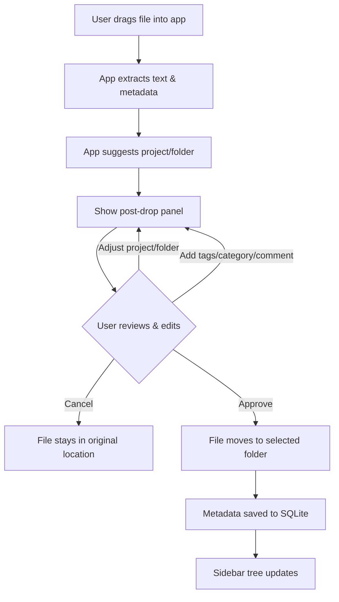
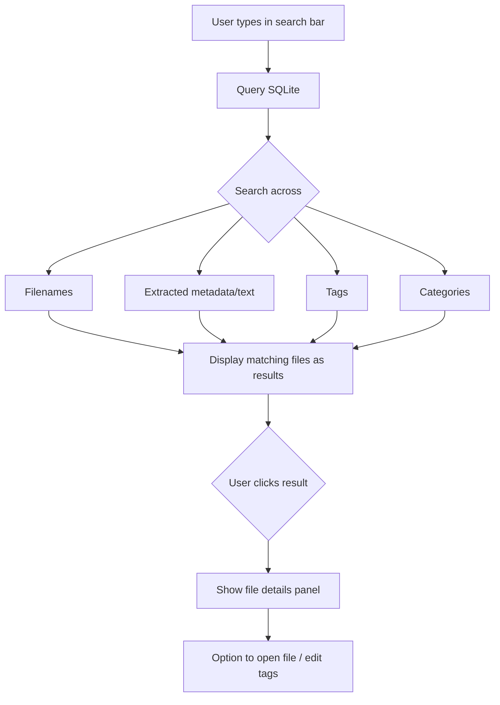
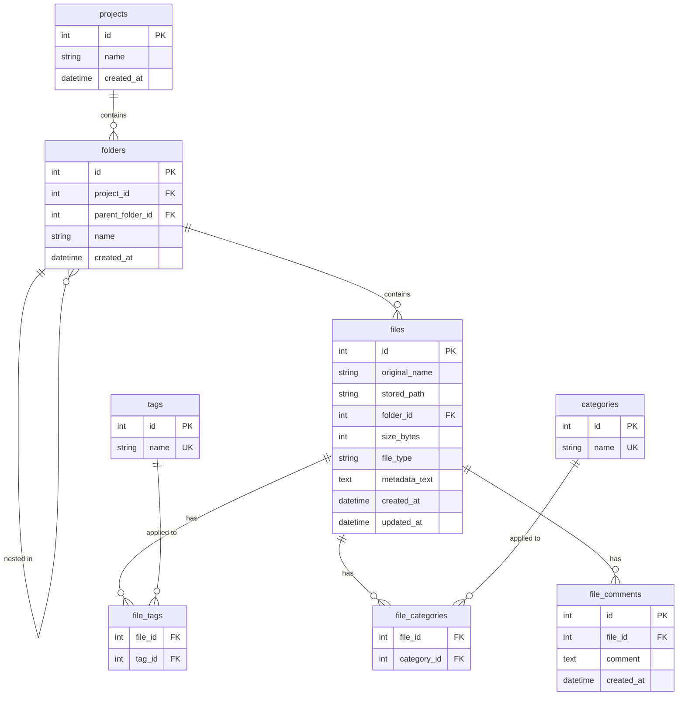

# jDocs - Project Plan

## Current State
**Phase:** Development
**Status:** Session 04 complete

## Session Roadmap

> Sessions may be added, split, or reordered as the project evolves.

---

### Session 01 — Project Skeleton & UI Framework Decision
**Status:** Done | **Date:** 2026-02-09

**Deliverable:** Launchable app window with base layout skeleton.

**What was built:**
- Chose PyQt5 over CustomTkinter (better drag & drop, more flexible layouts)
- `src/main.py` — app entry point with MainWindow, Sidebar (tree widget), DropZone, search bar
- `requirements.txt` with all planned dependencies
- Layout: search bar (top) > sidebar (left, 220px) + main panel (drop zone + file info placeholder)

**Key decisions:**
- PyQt5 for UI — larger exe size (~80-150MB) but worth it for drag & drop and widget ecosystem

---

### Session 02 — Database Schema & Core Data Layer
**Status:** Done | **Date:** 2026-02-09

**Deliverable:** Working `src/database.py` module with CRUD operations and 18 passing tests.

**What was built:**
- `src/database.py` — SQLite database layer with full CRUD for projects, folders, files, tags, categories, comments
- `tests/test_database.py` — 18 tests covering all operations
- Schema: 7 tables (projects, folders, files, tags, categories, file_tags, file_categories, file_comments)
- Indexes on files(folder_id), files(file_type), folders(project_id)

**Key decisions:**
- CASCADE deletes (project deletion removes all child data)
- INSERT OR IGNORE for tags/categories (duplicates are no-ops)
- sqlite3.Row factory for dict-like access
- `metadata_text` column stores extracted content (used by Session 03's extractor)

---

### Session 03 — File Metadata Extraction Engine
**Status:** Done | **Date:** 2026-02-09

**Deliverable:** Working `src/extractor.py` module with unified `extract()` interface and 21 passing tests.

**What was built:**
- `src/extractor.py` — `extract(file_path) -> dict` dispatching to type-specific handlers
  - Word (.docx): paragraph text, author, title, paragraph_count
  - Excel (.xlsx): cell text (first 50 rows/sheet), sheet_count, per-sheet names and row_counts
  - PowerPoint (.pptx): slide text, author, title, slide_count
  - Images (.png, .jpg): dimensions, format, mode, EXIF data
  - Code files (.py, .js, etc.): raw text, line_count, char_count
- `tests/test_extractor.py` — 21 tests across 6 test classes
- `tests/samples/` — 6 sample files (docx, xlsx, pptx, png, jpg, py)

**Key decisions:**
- Consistent return dict: `file_name`, `file_type`, `size_bytes`, `text`, `metadata`, `error`
- paragraph_count instead of page_count (python-docx can't determine page count)
- Unsupported file types return a metadata note, not an error (app can still organize them)
- EXIF values filtered to simple types (str/int/float) for SQLite compatibility

---

### Session 04 — Drag & Drop File Input Workflow
**Status:** Done | **Date:** 2026-02-09

**Deliverable:** Functional drag & drop (and click-to-browse) — user drops a file, sees extracted metadata, selects project/folder, and can approve or cancel.

**What was built:**
- `src/main.py` rewritten — DropZone with drag & drop events + click-to-browse file picker, PostDropPanel with file info/metadata preview/project-folder dropdowns/cancel-approve buttons, QStackedWidget panel switching, in-memory database with sample data, sidebar loaded from DB
- `src/extractor.py` — added dedicated CSV handler (first 100 rows, column names, fast row counting), optimized Excel to stream rows instead of loading all into memory
- `tests/test_extractor.py` — added 7 CSV extraction tests (46 total tests passing)
- `tests/samples/sample.csv` — sample CSV test file

**Key decisions:**
- pyqtSignal decoupling: DropZone emits `file_dropped(str)` without knowing about extractor or database
- CSV gets its own handler (not treated as code file) — reads only 100 rows for speed on large files
- Buttons pinned outside QScrollArea so they're always visible regardless of metadata length
- Click-to-browse via QFileDialog as alternative input method (same signal path as drag & drop)
- Column names capped at 10 in metadata display to prevent UI overflow

---

### Session 05 — Tagging, Categorization & Folder Management
**Status:** Planned | **Date:** TBD

**Deliverable:** Tag/category/comment input on the post-drop panel, ability to create new projects/folders, file move on approve.

---

### Session 06 — Search Functionality
**Status:** Planned | **Date:** TBD

**Deliverable:** Working search bar with filters across filenames, metadata, tags, and categories.

---

### Session 07 — First Launch Setup & Root Folder Config
**Status:** Planned | **Date:** TBD

**Deliverable:** First-run wizard to select root folder, settings persistence.

---

### Session 08 — Polish, Error Handling & Testing
**Status:** Planned | **Date:** TBD

**Deliverable:** Stable app with edge case handling and comprehensive test coverage.

---

### Session 09 — PyInstaller Packaging & Distribution
**Status:** Planned | **Date:** TBD

**Deliverable:** Standalone .exe (Windows) and .app (macOS).

---

## App Layout

```
+----------------------------------------------------------+
|  jDocs                                            [—][x] |
+----------------------------------------------------------+
|  [ Search files, tags, metadata...              ] [Filter]|
+----------------------------------------------------------+
|  Projects        |                                        |
|  ┌──────────┐    |     +----------------------------+     |
|  │ > Work   │    |     |                            |     |
|  │   Reports│    |     |     Drop files here        |     |
|  │   Slides │    |     |                            |     |
|  │ > Personal│   |     +----------------------------+     |
|  │   Photos │    |                                        |
|  │   Code   │    |     Select or drop a file to see       |
|  │          │    |     details                            |
|  │          │    |                                        |
|  │[+Project]│    |                                        |
|  └──────────┘    |                                        |
+----------------------------------------------------------+
```

### After File Drop (target state)

```
+----------------------------------------------------------+
|  [ Search files, tags, metadata...              ] [Filter]|
+----------------------------------------------------------+
|  Projects        |  File: quarterly_report.xlsx           |
|  ┌──────────┐    |  ┌──────────────────────────────────┐  |
|  │ > Work   │    |  │ Project:  [Work Documents  v]    │  |
|  │   Reports│    |  │ Folder:   [Reports         v]    │  |
|  │   Slides │    |  │                                  │  |
|  │ > Personal│   |  │ Tags:     [quarterly] [finance]  │  |
|  │   Photos │    |  │ Category: [Report          v]    │  |
|  │   Code   │    |  │ Comment:  [                   ]  │  |
|  │          │    |  │                                  │  |
|  │          │    |  │ Extracted metadata:               │  |
|  │          │    |  │  Sheets: 3 | Rows: 142           │  |
|  │          │    |  │  Author: John D.                  │  |
|  │          │    |  │                                  │  |
|  │          │    |  │    [Cancel]  [Approve & Move]    │  |
|  └──────────┘    |  └──────────────────────────────────┘  |
+----------------------------------------------------------+
```

## Use Case 1 — Input New File



## Use Case 2 — Search



## Database Schema



## Up Next
**Session 05** — Tagging, categorization & folder management (tag/category/comment input, create new project/folder, file move on approve).
