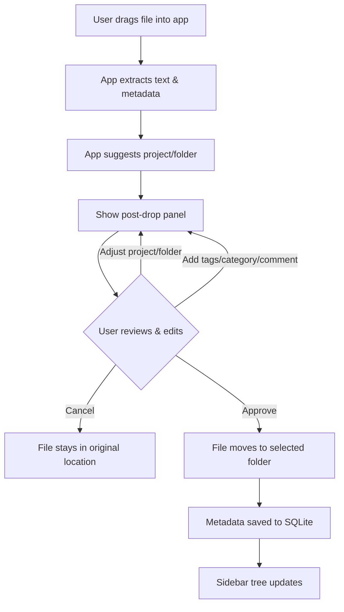
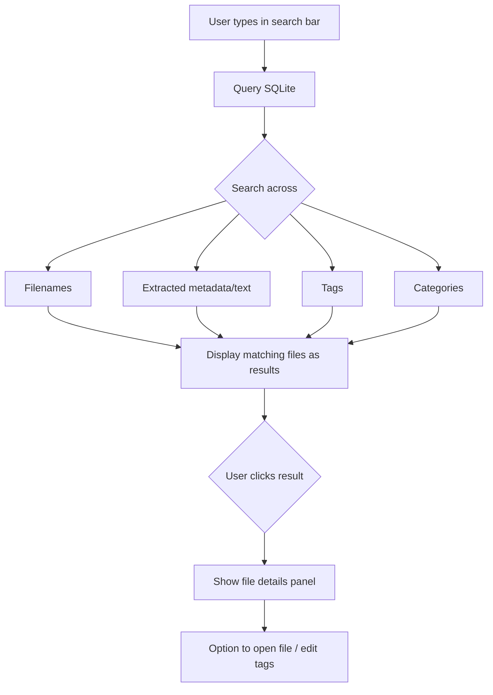
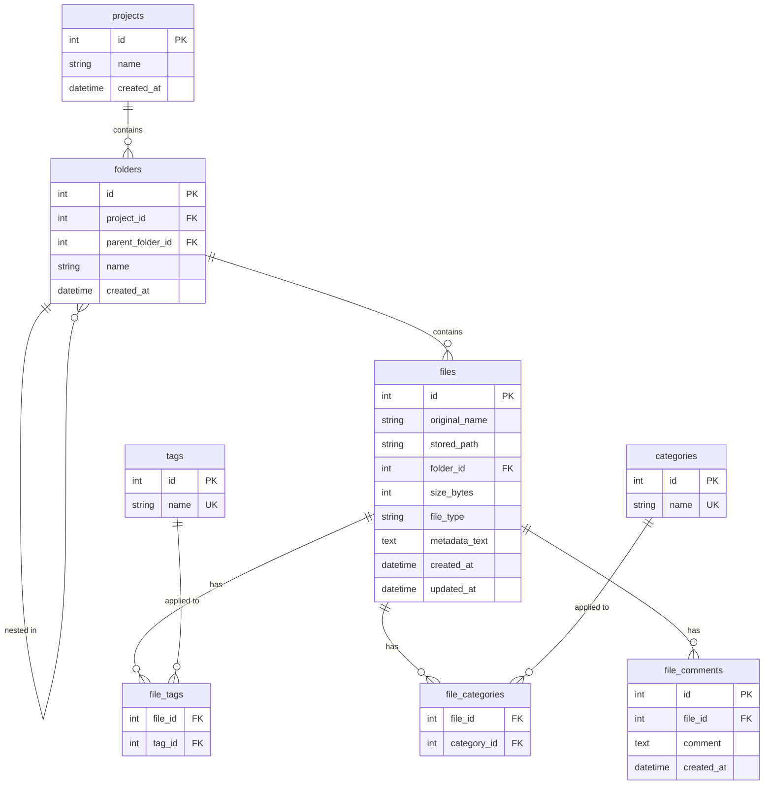

# jDocs - Project Plan

## Current State
**Phase:** Development
**Status:** Session 10 complete

## Session Roadmap

> Sessions may be added, split, or reordered as the project evolves.

---

### Session 01 — Project Skeleton & UI Framework Decision
**Status:** Done | **Date:** 2026-02-09

**Deliverable:** Launchable app window with base layout skeleton.

**What was built:**
- Chose PyQt5 over CustomTkinter (better drag & drop, more flexible layouts)
- `src/main.py` — app entry point with MainWindow, Sidebar (tree widget), DropZone, search bar
- `requirements.txt` with all planned dependencies
- Layout: search bar (top) > sidebar (left, 220px) + main panel (drop zone + file info placeholder)

**Key decisions:**
- PyQt5 for UI — larger exe size (~80-150MB) but worth it for drag & drop and widget ecosystem

---

### Session 02 — Database Schema & Core Data Layer
**Status:** Done | **Date:** 2026-02-09

**Deliverable:** Working `src/database.py` module with CRUD operations and 18 passing tests.

**What was built:**
- `src/database.py` — SQLite database layer with full CRUD for projects, folders, files, tags, categories, comments
- `tests/test_database.py` — 18 tests covering all operations
- Schema: 7 tables (projects, folders, files, tags, categories, file_tags, file_categories, file_comments)
- Indexes on files(folder_id), files(file_type), folders(project_id)

**Key decisions:**
- CASCADE deletes (project deletion removes all child data)
- INSERT OR IGNORE for tags/categories (duplicates are no-ops)
- sqlite3.Row factory for dict-like access
- `metadata_text` column stores extracted content (used by Session 03's extractor)

---

### Session 03 — File Metadata Extraction Engine
**Status:** Done | **Date:** 2026-02-09

**Deliverable:** Working `src/extractor.py` module with unified `extract()` interface and 21 passing tests.

**What was built:**
- `src/extractor.py` — `extract(file_path) -> dict` dispatching to type-specific handlers
  - Word (.docx): paragraph text, author, title, paragraph_count
  - Excel (.xlsx): cell text (first 50 rows/sheet), sheet_count, per-sheet names and row_counts
  - PowerPoint (.pptx): slide text, author, title, slide_count
  - Images (.png, .jpg): dimensions, format, mode, EXIF data
  - Code files (.py, .js, etc.): raw text, line_count, char_count
- `tests/test_extractor.py` — 21 tests across 6 test classes
- `tests/samples/` — 6 sample files (docx, xlsx, pptx, png, jpg, py)

**Key decisions:**
- Consistent return dict: `file_name`, `file_type`, `size_bytes`, `text`, `metadata`, `error`
- paragraph_count instead of page_count (python-docx can't determine page count)
- Unsupported file types return a metadata note, not an error (app can still organize them)
- EXIF values filtered to simple types (str/int/float) for SQLite compatibility

---

### Session 04 — Drag & Drop File Input Workflow
**Status:** Done | **Date:** 2026-02-09

**Deliverable:** Functional drag & drop (and click-to-browse) — user drops a file, sees extracted metadata, selects project/folder, and can approve or cancel.

**What was built:**
- `src/main.py` rewritten — DropZone with drag & drop events + click-to-browse file picker, PostDropPanel with file info/metadata preview/project-folder dropdowns/cancel-approve buttons, QStackedWidget panel switching, in-memory database with sample data, sidebar loaded from DB
- `src/extractor.py` — added dedicated CSV handler (first 100 rows, column names, fast row counting), optimized Excel to stream rows instead of loading all into memory
- `tests/test_extractor.py` — added 7 CSV extraction tests (46 total tests passing)
- `tests/samples/sample.csv` — sample CSV test file

**Key decisions:**
- pyqtSignal decoupling: DropZone emits `file_dropped(str)` without knowing about extractor or database
- CSV gets its own handler (not treated as code file) — reads only 100 rows for speed on large files
- Buttons pinned outside QScrollArea so they're always visible regardless of metadata length
- Click-to-browse via QFileDialog as alternative input method (same signal path as drag & drop)
- Column names capped at 10 in metadata display to prevent UI overflow

---

### Session 05 — Tagging, Categorization & Folder Management
**Status:** Done | **Date:** 2026-02-09

**Deliverable:** Full input-to-save flow with tags, category, comment, project/folder creation, and database persistence.

**What was built:**
- `src/main.py` — added tag input (comma-separated QLineEdit), editable category QComboBox, comment QLineEdit, "+" buttons for new project/folder creation (QInputDialog), full Approve logic with validation and DB save
- `src/database.py` — added `list_tags()` and `list_categories()` helper methods
- Approve flow: validates project/folder selection -> `db.add_file()` -> saves tags/category/comment -> refreshes sidebar -> shows green success message

**Key decisions:**
- Tags as free-text comma-separated input (flexible, no constraint to existing tags)
- Category as editable QComboBox (pick existing or type new, auto-created on save)
- Validation before save (project + folder required, QMessageBox warnings)
- stored_path records original file location (physical move deferred to Session 07 root folder setup)
- Sidebar refreshes after every create/approve to stay in sync

---

### Session 06 — Search Functionality
**Status:** Done | **Date:** 2026-02-09

**Deliverable:** Working search with results as clickable cards, file detail view, and back navigation.

**What was built:**
- `src/database.py` — `search_files()` method querying across filename, metadata_text, file_type, and tags with case-insensitive LIKE, DISTINCT deduplication, and project/folder enrichment
- `src/main.py` — SearchResultsPanel (scrollable card-based results with hover effects), FileDetailPanel (read-only file info with comments/metadata preview), search bar wired to Enter key, QStackedWidget expanded to 4 pages
- `tests/test_database.py` — 8 new search tests (filename, metadata, tag, file_type, dedup, project/folder, empty query, no matches)

**Key decisions:**
- SQL LIKE over FTS5 (sufficient for desktop scale, simpler setup)
- Search on Enter key only (not every keystroke)
- Results enriched with tags via individual queries (fast enough for expected result sizes)
- FileDetailPanel shows stored metadata_text, not re-extracted data (works even if file is moved/deleted)

---

### Session 07 — First Launch Setup & Root Folder Config ✓
**Status:** Done | **Date:** 2026-02-10

**Deliverable:** First-run wizard, persistent database, physical file copy on approve.

**What was built:**
- `src/settings.py` — config persistence module with cross-platform JSON storage (`%LOCALAPPDATA%` on Windows, `~/.config` on macOS/Linux), load/save with defaults fallback and corrupt file recovery
- `src/main.py` — `FirstLaunchDialog` (folder picker wizard blocking app until root is set), persistent `Database(<root>/.jdocs/jdocs.db)` replacing `:memory:`, removed `_seed_sample_data()`, file copy on approve with `shutil.copy2` and `_1`/`_2` duplicate handling, Settings menu with "Change Root Folder..." option
- `tests/test_settings.py` — 13 tests (platform paths, roundtrip, corrupt recovery, is_configured)

**Key decisions:**
- Copy, not move — originals stay in place, user never loses source files
- DB inside root folder (`.jdocs/jdocs.db`) — travels with data if root is moved
- Config in OS user data dir — app always finds it regardless of root location
- Change root folder = restart required (simpler than hot-swapping DB connections)
- Duplicate filenames get `_1`, `_2` suffixes instead of overwriting

---

### Session 08 — Polish, Error Handling & Testing ✓
**Status:** Done | **Date:** 2026-02-10

**Deliverable:** Stable app with edge case handling and comprehensive test coverage.

**What was built:**
- `src/utils.py` (new) — extracted `format_size`, `format_metadata`, `sanitize_name` from main.py into standalone module (no Qt dependency, testable anywhere)
- `src/main.py` — source file validation before copy, DB error cleanup (delete orphaned copy on failure), QMessageBox for extraction errors, name sanitization on project/folder creation, button text changed to "Approve & Copy", root folder indicator in sidebar, empty sidebar hint, removed unused QMenuBar import
- `src/extractor.py` — directory path check, 10MB file size cap for code/CSV, BadZipFile caught with user-friendly password-protected message
- `src/database.py` — IntegrityError on duplicate stored_path raises ValueError with clear message
- `tests/test_main.py` (new) — 28 tests for format_size, format_metadata, sanitize_name
- `tests/test_extractor.py` — 9 new tests for directories, corrupt/empty files, password-protected detection
- `tests/test_database.py` — 4 new tests for duplicate paths, SQL special chars, multi-word relevance ordering, comment search

**Key decisions:**
- Extracted pure functions to `src/utils.py` to avoid Qt import overhead in tests
- Copy-then-cleanup pattern for approve flow (if DB write fails, delete the copied file)
- 10MB cap on text extraction for code/CSV files to prevent memory issues with binary files
- BadZipFile → friendly "password-protected or corrupted" message rather than cryptic errors

---

### Session 09 — Multi-file Batch Upload & Folder Scanning ✓
**Status:** Done | **Date:** 2026-02-10 / 2026-02-11

**Deliverable:** Batch file input (drop/browse multiple files, all assigned to same project/folder/tags/comment) with 10-file limit; folder scan to detect untracked files in the root folder.

**What was built:**
- `src/main.py` — DropZone accepts multiple files (`files_dropped(list)` signal, `getOpenFileNames`), `MAX_BATCH_FILES = 10` with warning on overflow. PostDropPanel batch mode shows "X files selected" with file list, hides metadata preview. Approve loop processes all files with per-file error handling and cleanup. "Scan for Untracked Files..." menu item with QMessageBox results.
- `src/database.py` — `get_all_stored_paths()` returns set of all tracked paths
- `src/utils.py` — `scan_untracked_files()` walks root folder, skips `.jdocs/`, returns untracked files with name/path/size
- `src/extractor.py` — Fixed corrupt file detection for python-docx 1.2.0 ("Package not found" error)
- Tests: 116 total passing (33 database + 28 extractor + 38 utils + 13 settings + 4 new for scanning)

**Key decisions:**
- Batch approve continues on individual file failure, reports all errors at end
- Folder scan is informational only (no import action — future enhancement)
- Extraction errors during batch: skip failed files with warning, process the rest
- Venv (`.venv/`) used for isolated testing with Python 3.10

---

### Session 10 — Search Results Redesign & File Details Enhancements ✓
**Status:** Done | **Date:** 2026-02-11

**Deliverable:** Cleaner search results layout (QListWidget with styled rows), "Open file location" from file details, edit tags/comments on existing files.

**What was built:**
- `src/main.py` — SearchResultsPanel rewritten with QListWidget + setItemWidget() (colored file type badges, bold filename, project/folder, tags, file size per row). FileDetailPanel now has editable tags (QLineEdit), comments with delete buttons, new comment input, "Save Changes" button, and "Open File Location" button using QDesktopServices. New `TagSuggestionBar` widget shows clickable tag chips below tag inputs in both PostDropPanel and FileDetailPanel.
- `src/database.py` — `get_popular_tags(project_id, limit)` returns most-used tags by frequency. Bug fix in `create_tag`/`create_category`: `lastrowid` → `rowcount` for correct duplicate detection.
- Signal-based save: FileDetailPanel emits `save_clicked`/`delete_comment_clicked`, MainWindow handles DB operations and refreshes the panel.
- Tests: 120 total (4 new for popular tags)

**Key decisions:**
- QListWidget over QTableWidget (simpler for variable-width row content)
- FileDetailPanel stays decoupled from DB (signals pattern, matching PostDropPanel)
- "Add" comment triggers full save for simpler UX
- Badge colors hardcoded per extension
- Tag suggestions: frequency-ranked, project-scoped when available, chips dim when tag already entered

---

### Session 11 — UI/UX Polish
**Status:** Planned | **Date:** TBD

**Deliverable:** Visual and interaction improvements based on backlog items.

**Planned scope (candidates — will finalize at session start):**
- Tag badge/chip UI: visual chips with "x" to remove instead of comma-separated text input
- File list in sidebar: show files when a folder is selected in the tree
- Open file from app: double-click to open in default application
- Dark theme support: respect system theme instead of hardcoded light backgrounds
- Other quick wins from backlog

---

### Session 12 — PyInstaller Packaging & Distribution
**Status:** Planned | **Date:** TBD

**Deliverable:** Standalone .exe (Windows) and .app (macOS) that run without Python installed.

---

### Session 13 — PDF Support & Future Enhancements
**Status:** Planned | **Date:** TBD

**Deliverable:** PDF text extraction, plus any remaining backlog items.

---

## App Layout

```
+----------------------------------------------------------+
|  jDocs                                            [—][x] |
+----------------------------------------------------------+
|  [ Search files, tags, metadata...              ] [Filter]|
+----------------------------------------------------------+
|  Projects        |                                        |
|  ┌──────────┐    |     +----------------------------+     |
|  │ > Work   │    |     |                            |     |
|  │   Reports│    |     |     Drop files here        |     |
|  │   Slides │    |     |                            |     |
|  │ > Personal│   |     +----------------------------+     |
|  │   Photos │    |                                        |
|  │   Code   │    |     Select or drop a file to see       |
|  │          │    |     details                            |
|  │          │    |                                        |
|  │[+Project]│    |                                        |
|  └──────────┘    |                                        |
+----------------------------------------------------------+
```

### After File Drop (target state)

```
+----------------------------------------------------------+
|  [ Search files, tags, metadata...              ] [Filter]|
+----------------------------------------------------------+
|  Projects        |  File: quarterly_report.xlsx           |
|  ┌──────────┐    |  ┌──────────────────────────────────┐  |
|  │ > Work   │    |  │ Project:  [Work Documents  v]    │  |
|  │   Reports│    |  │ Folder:   [Reports         v]    │  |
|  │   Slides │    |  │                                  │  |
|  │ > Personal│   |  │ Tags:     [quarterly] [finance]  │  |
|  │   Photos │    |  │ Category: [Report          v]    │  |
|  │   Code   │    |  │ Comment:  [                   ]  │  |
|  │          │    |  │                                  │  |
|  │          │    |  │ Extracted metadata:               │  |
|  │          │    |  │  Sheets: 3 | Rows: 142           │  |
|  │          │    |  │  Author: John D.                  │  |
|  │          │    |  │                                  │  |
|  │          │    |  │    [Cancel]  [Approve & Move]    │  |
|  └──────────┘    |  └──────────────────────────────────┘  |
+----------------------------------------------------------+
```

## Use Case 1 — Input New File



## Use Case 2 — Search



## Database Schema



## Up Next
**Session 11** — UI/UX polish.
